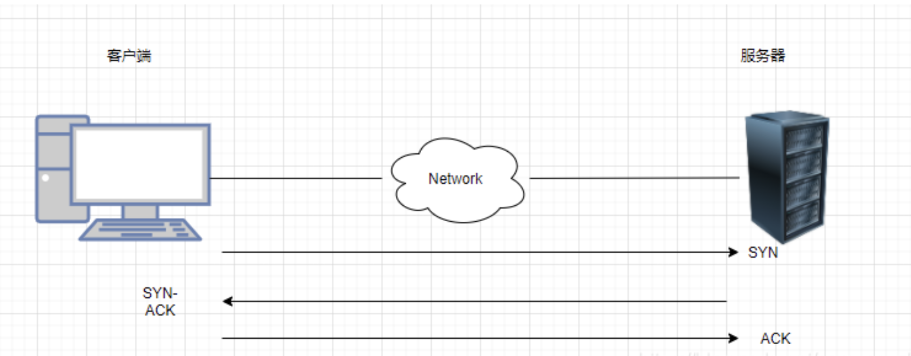
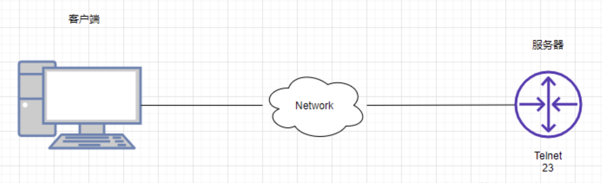
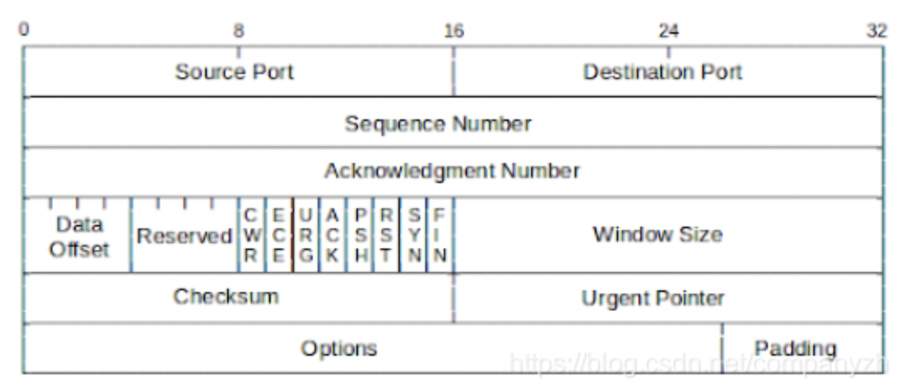
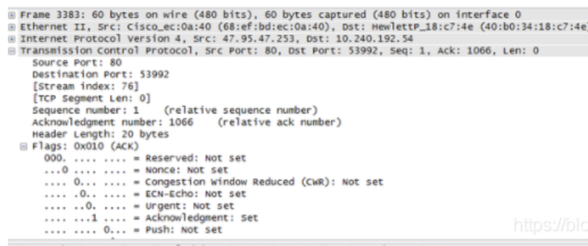
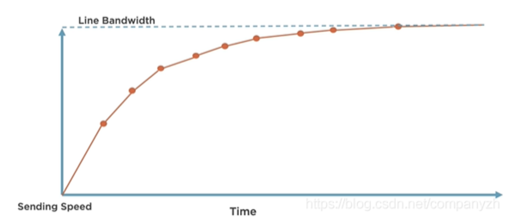
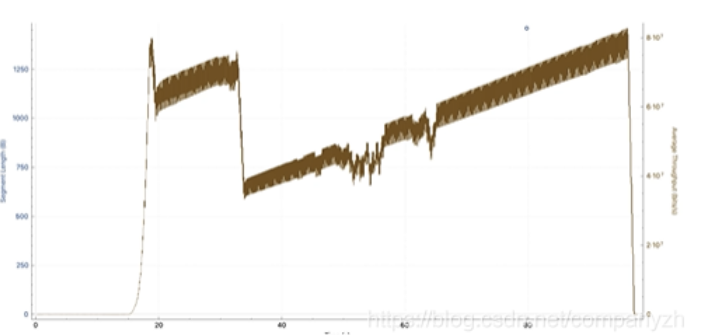

# **第一节 TCP协议**

传输层的重要协议TCP

## **1 TCP**

**TCP的全称是Transmission Control Protocol。**

这个协议的目的就是创建一个Session，通过这个Session来传输数据。

**我们在数据链路层查看了源和目标Mac地址，并看到了这些Mac地址是使我们能够将流量从一台设备发送到其自己局域网中的另一台设备。**

**网络层，也就是IP**，了解了网络层的地址如何使我们能够从一个网络上的一个设备与世界其他地方的另一个设备进行通信。

现在又到了TCP，TCP所要做的就是允许我们在网络上的两个设备之间创建会话，然后通过这个会话来传输数据。

HTTP超文本传输协议是我们用于传输Web页面的协议)。在HTTP的服务端需要有完全不同的软件在运行，也就是我们说的服务器，服务器是有很多的选择，比如Apache是一个非常流行的开源Web服务器。当然还有老牌的微软IIS等等。现在这里要做的就是客户端看做是一个设备说“你能给我发送网站吗？”。

## **2 三次握手和四次挥手**

* 三次握手的精髓，那就是客户端会先向服务器端发送一个SYN，
* 然后服务器端会发送回一个SYN-ACK。
* （ACK一般表示收到）然后客户端会再回复一个ACK。

经过了三次通信也就是三次握手之后，这才能建立起连接，说明双方都没有问题，可以开始唠嗑了。

聊完之后。不能突然就断开了吧。这样太没有礼貌了。所以需要经过一个流程也就是我们说的四次分手。

这是一个非常优雅的过程。

* 首先服务端会发一个FIN消息。
* 然后客户端回一个FIN-ACK。
* 然后客户端会发送一个自己的FIN 消息。
* 然后服务器发送一个FIN-ACK。

**这样双方就终止了通信。当然4次分手不是唯一的断开的方式。还有一种方式叫做Reset。**

想象一下客户端只是向Web服务器询问该网页。

服务器回应说，这是网页。

现在可能发生的事情是，任何时候任何一端都可以发送TCP重置消息（reset）。

**为什么它会发送TCP重置消息而不执行四次分手呢？因为有时我们可能在PC和Web服务器之间安装了一个安全设备**，如果网络中发现某些不应该在网络上传入和传出的内容。

这些设备的安全措施可能会发送TCP重置。该设备通常被编程为发送TCP重置并仅关闭两个设备之间的通信，所以这种情况的发生是很不友好的。其中一端（在这种情况下可能是Web服务器）将发送TCP重置。一旦这个客户收到了RST，连接就会立即关闭。

**我们将无法再发送数据。哪端都可以发送这个RESET。任何时候都可以。完全取决于你使用的软件。**

## **2 端口号**

我们看传输层寻址之前再来穿插一下端口号（我的思维就是这么活跃）。

端口号的范围从0到65535，通过端口号被分为三个不同的类别。

* 公认端口（Well-Known）0-1023
* 注册端口（Registered）1024-49151
* 临时端口（Ephemeral）49152-65535

服务器端口号是为非常特定的服务器应用程序层协议设计的。客户端的这些临时端口号主要用于一个会话的临时时间段，然后可以将该端口号扔掉或放回池中，以后我们可能会也可能不会重复使用该端口号。这些客户端端口号将在我们网络上的不同TCP会话中重复使用。

* HTTP - 80
* HTTPS - 443
* FTP - 20,21
* SSH - 22
* Telnet - 23

### **2-1 公认端口**

这些端口已经存在很长时间了，是经过实践检验的协议，所以称为公认端口。诸如Http使用端口80，https（这是HTTP的加密版本，使用443）。

FTP，出于不同的目的使用了两个不同的端口号，这使它使用起来有点麻烦和复杂，尤其是对于通过防火墙。SSH，使用端口22。Telnet使用端口23。当然还有很多就不一一列举了。

### **2-2 注册端口**

然后是注册端口，它们可以是官方的也可以是非官方的。

官方的意思就是该自定义应用程序的组织已经将使用的端口号注册到了Internet Assigned Numbers Authority（IANA）。

比如微软的Microsoft Windows Internet Name Service (WINS)。

它就是注册了端口号1512。还比如Cisco HSRP或者叫做Hot Standby Router Protocol注册了端口号1985。以及Microsoft Point-to-Point Tunneling Protocol (PPTP)点到点协议注册了1723。

这三个例子都是正式注册的端口号。

还有另一种程序当然就是非官方的，比如游戏Civilization（文明）。使用的就是端口号2033。这意味着我们知道这个游戏将使用这个端口，但尚未正式注册。这是否意味着我们不能使用它了呢？当然不是。我们可以使用它。我们只需要知道某个特定的程序会使用它即可。

**所有这些公认和注册的端口号会赋给应用层上的程序。服务器会监听这些端口号**。

## **3 TCP Header**

上图就是一个TCP Header的文件。我们还是一点点的来分析。 

* Source Port（源端口）：源TCP的用户 
* Destination Port（目标端口）：目标TCP 用户的端口 
* Sequence Number（序列号）: 第一个数据字节的序列号（SYN标志除外）。

如果设置了SYN，则此字段包含初始序列号（ISN）。

下面的例子很严重依赖这个序列号，你想不明白都难。 

* Acknowledgment Number（确认号）: 包含TCP期望接收的下一个数据的序列号。 
* Data Offset（数据偏移）: 头中32位字的数量。 
* Reserved（保留）: 为以后保留使用。 
* Flags（标识）:这里有几种数值，我在下面扩展讲。
* Window （窗口大小）：TCP流量控制的一个手段，用来告诉对端TCP缓冲区还能容纳多少字节。 
* CheckSum（校验）: 由发送方填充，接收方对报文段执行CRC算法以检验TCP报文段在传输中是否损坏。 
* Urgent Pointer（紧急指针）：一个正的偏移量，它和序号段的值相加表示最后一个紧急数据的下一字节的序号，接收方可以通过此来知道有多少紧急的数据用过来。 
* Options + Padding:可选和填充项。

### **3-1 Flags**

* **CWR：拥塞窗口减少标志** 
* **ECE: ECN响应标志被用来在TCP3次握手时表明一个TCP端是具备ECN功能的**
* **URG: 紧急标志** 
* **ACK: 确认标志，还记得三次握手吗** 
* **RST: Reset连接**，
* **SYN: 同步序列号** 
* **FIN: 发送方没有数据了，想想四次分手**

我们来看一下这个图，这个还是用wireshark抓下来的包，你可以从图上清楚的看到我们上面讲的TCP header都在实际的包中。

## **4 TCP高级篇（拥塞模型）**

首先我们可以肯定的是TCP协议是可靠的。

它是可靠地从网络上的一个端点到另一端点获取数据，但是它不希望使两者之间的网络不堪重负。

**TCP不想非常快的就开始发送数据，这样会导致拥塞和数据包丢失。**

*同样，TCP也不想“欺负”其他的网络，把其他所有协议都淘汰掉，优先考虑自己的流量。因此，通过TCP拥塞控制，TCP能够确定网络上的拥塞并相应地调整其传输速率。

通常，我们开始传输该文件，并且我们想象的是，发送速度逐渐提高，并逐渐接近带宽。我们能够用吞吐量完全填满网络，并且该文件能够尽快通过链接传输。就像下图一样

从图上可以看到吞吐量的变化。

最初会上升，然后略有下降。它会先恢复一段时间，然后再次下降，然后随着时间的推移缓慢重建。因此现实是，TCP不会完全填充网络，当我们将文件从一个端点传输到另一个端点时。

会有很多事情来控制。造成这种情况的原因是，TCP被设计为在端点之间具有不可预测的网络的情况下非常智能，现实也确实如此。今

天，我们正在处理无线，高延迟，高损耗，多路径，高拥塞的情况。因此，这两个端点需要确定它们之间网络中正在发生的事情，并尽其最大可能地填充它，并以最有效的方式将数据从A点移动到B点。而

**TCP正是通过拥塞机制来进行控制的。这也是为什么它很重要的原因。**

### **拥塞检测机制**

TCP如何知道出现问题并相应的退出其拥塞窗口？决定拥塞算法退避的主要方法有两种

**第一种是丢包**。

因此，在这里我们可以看到服务器发送了两个数据包，并且得到了很好的确认。然后发出四个数据包，其中一个数据包丢失。这就是说，我试过发出四个，但是效果不好，既然这样我就坚持每次网络往返都使用2MSS。

**另一种拥塞检测机制是测量延时**。

服务器发送了几个数据包。就好像短跑比赛一样，这时候按下启动秒表。当看到这些数据包的确认返回时，便可以停止该秒表并测量延迟。该等待时间（延迟）不应该有显着变化。

通常，仅当某处的链接出现拥塞时，它才会发生变化。让我们再想象一下，该服务器发送了几个数据包，但是这次要花费更多的时间才能从客户端取回确认。说明什么问题？是不是说明发生了拥堵。

